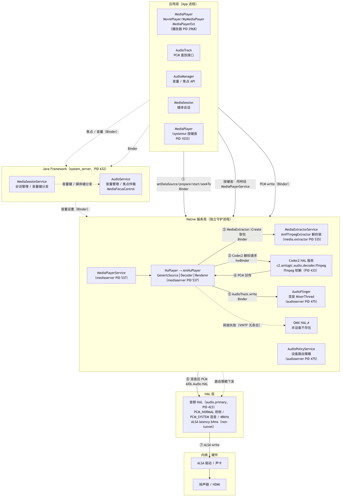
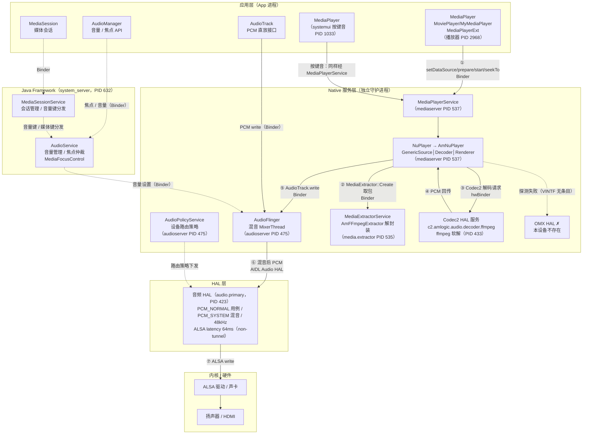
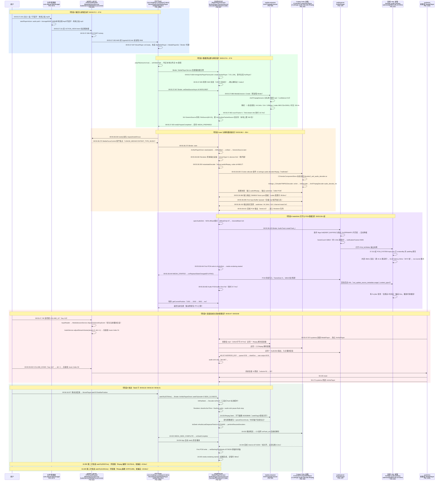

# Audio

## Android 14 Audio 模块整体架构

> 五层架构：应用层 → Java Framework → Native 服务层 → HAL 层 → 内核/硬件。
> 实线（①-⑦）= 媒体数据流；虚线 = 控制流。进程 PID 均取自本设备（Amlogic AOSP14）实测日志。

架构图 mermaid 源码（点击展开，修改后可重新渲染）

## 核心播放链路进程（6 个）

| 进程                                                       | PID                      | 角色                             | **关键组件（日志佐证）**                                     |
| ---------------------------------------------------------- | ------------------------ | -------------------------------- | ------------------------------------------------------------ |
| **文件管理器** com.starnet.filemanager                     | 2573                     | 触发源                           | FileActivity：识别点击的音频，发 `ACTION_VIEW` 拉起播放器    |
| **播放器 App** com.droidlogic.exoplayer2.demo（AM Player） | 2968（由 Zygote 410 fork | 用户态客户端：UI + Binder 客户端 | MoviePlayer（Activity/UI/进度条）、MyMediaPlayer（封装 android.media.MediaPlayer）、**MediaPlayerExt**（Amlogic vendor 扩展，[:325](vscode-webview://1k209ksk0vj2fgsb54fucalmm2brcf034ud394plalqve86cu2t9/note-mac/media/audio/play_local_audio_file.log#L325)）、MediaSessionCompat、SubtitleManager、PreparedTimeoutTracker |
| **mediaserver**                                            | 537                      | 播放引擎主体（Binder 服务端）    | **MediaPlayerService**（每个播放器一个 Client，[:369](vscode-webview://1k209ksk0vj2fgsb54fucalmm2brcf034ud394plalqve86cu2t9/note-mac/media/audio/play_local_audio_file.log#L369)）、**AmlogicNuPlayerFactoryInit → AmNuPlayerDriver/AmNuPlayer**（替代标准 NuPlayer，V5.1.206，[:341-348](vscode-webview://1k209ksk0vj2fgsb54fucalmm2brcf034ud394plalqve86cu2t9/note-mac/media/audio/play_local_audio_file.log#L341-L348)）、**NU-GenericSource**（FileSource 读 fd、AmAnotherPacketSource 包队列、[:645](vscode-webview://1k209ksk0vj2fgsb54fucalmm2brcf034ud394plalqve86cu2t9/note-mac/media/audio/play_local_audio_file.log#L645)）、**NU-AmNuPlayerDecoder**、**NU-AmNuPlayerRenderer**（AudioSink 打开/排空、AV 同步、PTS 锚点）、**CCodec/CCodecBufferChannel**（Codec2 客户端，[:805](vscode-webview://1k209ksk0vj2fgsb54fucalmm2brcf034ud394plalqve86cu2t9/note-mac/media/audio/play_local_audio_file.log#L805)）、MediaCodec（异步模式）、AmlPlayerTimer/MessageMonitor（Amlogic 自研打点设施）、BufferPoolAccessor（客户端缓冲池） |
| **media.extractor**                                        | 535                      | 解封装服务                       | **AmFFmpegExtractor**（MediaExtractor::Create 返回 `extractor name:AmFFmpegExtractor`，[:456](vscode-webview://1k209ksk0vj2fgsb54fucalmm2brcf034ud394plalqve86cu2t9/note-mac/media/audio/play_local_audio_file.log#L456)；嗅探/解封装/字节级 seek，[:403-436](vscode-webview://1k209ksk0vj2fgsb54fucalmm2brcf034ud394plalqve86cu2t9/note-mac/media/audio/play_local_audio_file.log#L403-L436), [:2553](vscode-webview://1k209ksk0vj2fgsb54fucalmm2brcf034ud394plalqve86cu2t9/note-mac/media/audio/play_local_audio_file.log#L2553)）、AmFFmpegByteIOAdapter、AmFFmpegSource、StreamFormatter |
| **Codec2 HAL 进程**                                        | 433                      | 解码服务（hwBinder 服务端）      | **C2VendorComponentStore**（加载 `libcodec2_aml_audio_decoder.so`，[:827-830](vscode-webview://1k209ksk0vj2fgsb54fucalmm2brcf034ud394plalqve86cu2t9/note-mac/media/audio/play_local_audio_file.log#L827-L830)）、**Amlogic_C2AudioFFMPEGDecoder**（组件 `c2.amlogic.audio.decoder.ffmpeg`，[:805](vscode-webview://1k209ksk0vj2fgsb54fucalmm2brcf034ud394plalqve86cu2t9/note-mac/media/audio/play_local_audio_file.log#L805)）、AmAudioCodec/**AmFFmpegDecoder**（ffmpeg 软解 mp3float，[:971](vscode-webview://1k209ksk0vj2fgsb54fucalmm2brcf034ud394plalqve86cu2t9/note-mac/media/audio/play_local_audio_file.log#L971)）、BufferPoolAccessor（服务端 DMABUF 缓冲池） |
| **audioserver**                                            | 475                      | 音频混音                         | **AudioFlinger**：`createTrack_l()` 创建音轨（[:1061](vscode-webview://1k209ksk0vj2fgsb54fucalmm2brcf034ud394plalqve86cu2t9/note-mac/media/audio/play_local_audio_file.log#L1061)）、notificationFrames/frameCount 管理（[:1063](vscode-webview://1k209ksk0vj2fgsb54fucalmm2brcf034ud394plalqve86cu2t9/note-mac/media/audio/play_local_audio_file.log#L1063)） |
| **音频 HAL 进程**（Amlogic audio.primary）                 | 423                      | 硬件抽象/最终输出                | **audio_hw_hal_primary**（latency 64ms、source metadata，[:286](vscode-webview://1k209ksk0vj2fgsb54fucalmm2brcf034ud394plalqve86cu2t9/note-mac/media/audio/play_local_audio_file.log#L286)）、**audio_hw_hal_submixing**（PCM_NORMAL usecase、PCM_SYSTEM input port、48kHz 混音器，[:153-168](vscode-webview://1k209ksk0vj2fgsb54fucalmm2brcf034ud394plalqve86cu2t9/note-mac/media/audio/play_local_audio_file.log#L153-L168)）、audio_hw_hal_port/stream（端口配置、`non tunnel` PCM 流、position/jitter 监测，[:210-212](vscode-webview://1k209ksk0vj2fgsb54fucalmm2brcf034ud394plalqve86cu2t9/note-mac/media/audio/play_local_audio_file.log#L210-L212), [:1143](vscode-webview://1k209ksk0vj2fgsb54fucalmm2brcf034ud394plalqve86cu2t9/note-mac/media/audio/play_local_audio_file.log#L1143)）、audio_hw_hal_resourcemgr、AudioHalHardware（get/setParameters）→ 之下是 ALSA/内核 → 扬声器 |

## 总结

**一次音频播放至少要过 6 个进程**：App → mediaserver → media.extractor → Codec2 服务 → audioserver → 音频 HAL。这是 Android 14 把解封装（media.extractor 独立服务）和解码（Codec2 HAL 独立进程）都外置到独立进程的结果

###### **每个解封装/解码环节都多一次跨进程**：mediaserver 的 NU-GenericSource 用 Binder 调 media.extractor 取包，NU-AmNuPlayerDecoder 用 hwBinder 调 C2 服务解码

## 播放 U 盘音频文件完整时序图（基于 play_local_audio_file.log 实测）

> 说明：participant 标签 = 进程名 + PID；箭头上的时间戳取自日志原文；`Note` 标注对应组件的关键处理逻辑。
> 测试文件：《华晨宇 - 地球之盐.mp3》（U 盘 `/storage/6A6F-168B`，44.1kHz / 双声道 / 128kbps，时长 319.4s），操作序列：播放 → 音量加 → 音量减 → 快进 ×3。

### 各阶段关键处理逻辑解读

1. **触发层（2573→632→2968）**：FileActivity 只负责定位文件并转发 `ACTION_VIEW` Intent，真正播放由 AM Player 完成，进程冷启动由 AMS 经 Zygote fork（[play_local_audio_file.log:204](play_local_audio_file.log#L204)）。
2. **App 层（2968）**：`MediaPlayerExt` 通过 vendor framework 扩展标准 MediaPlayer（getMediaInfo 经 invoke 下发到 native，[log:325](play_local_audio_file.log#L325)）；`start()` 前先 `requestAudioFocus`，由 system_server 的 MediaFocusControl 仲裁（[log:639](play_local_audio_file.log#L639)）。
3. **mediaserver（537）**：Amlogic 用 `AmlogicNuPlayerFactoryInit` 工厂把标准 NuPlayer 整体替换为 **AmNuPlayer**（[log:341](play_local_audio_file.log#L341)）；GenericSource 在本地用 FileSource(fd=10) 读文件，包缓存到 AmAnotherPacketSource（本地播放上限 500 包/2MB）；每次创建先探测 OMX，失败后走 Codec2（[log:368-369](play_local_audio_file.log#L368-L369)）。
4. **media.extractor（535）**：`AmFFmpegExtractor` 白名单+置信度 0.8 嗅探识别 mp3（[log:403-405](play_local_audio_file.log#L403-L405)），输出 codec-id 86017(0x15001)；seek 按时间换算字节偏移 + `seekFlag:8`（AVSEEK_FLAG_FRAME）按帧对齐（[log:2553](play_local_audio_file.log#L2553)）。
5. **Codec2 HAL（433）**：C2 组件 `c2.amlogic.audio.decoder.ffmpeg` 由 C2VendorComponentStore 动态加载 `libcodec2_aml_audio_decoder.so`（[log:827-830](play_local_audio_file.log#L827-L830)），内部是 ffmpeg 软解（mp3float）；输出 `audio/raw` 16bit PCM；缓冲池走 DMABUF heap（[log:1004-1010](play_local_audio_file.log#L1004-L1010)）；MediaCodec 异步回调模式。
6. **Renderer（537 内）**：`openAudioSink` 为 **NON-offload** 模式（PCM 回灌路径，[log:1054-1056](play_local_audio_file.log#L1054-L1056)）；用 `setStartingTimeMedia` 锚定 PTS 起点，纯音频场景以音频为主时钟（AV sync info: Audio on Header）；seek 时负责 clearAnchorTime + audio sink pause-flush-stop（[log:2526-2550](play_local_audio_file.log#L2526-L2550)）。
7. **AudioFlinger（475）**：`createTrack_l` 收到 flags 0x8(DEEP_BUFFER) 与 PRIMARY 输出 0x2 不匹配的警告后自动降级（[log:1061](play_local_audio_file.log#L1061)），创建 18810 帧深缓冲音轨。
8. **音频 HAL（423）**：`PCM_NORMAL` usecase + `PCM_SYSTEM` input port，内部统一 48kHz 混音（源 44.1k 由 HAL 重采样），ALSA latency 64ms（3072 帧），`non tunnel` PCM 模式；运行期每 5s 打印 position/jitter 健康检查（[log:153-168](play_local_audio_file.log#L153-L168), [log:1143-1145](play_local_audio_file.log#L1143-L1145)）。
9. **音量链路**：音量键由 MediaSessionService 优先派发给活跃播放会话，AudioService 调整 stream=3（MUSIC）音量组索引（51↔50）；systemui 的按键音每次独立新建 MediaPlayer，走**与主播放完全相同的** AmNuPlayer → AmFFmpegExtractor → C2 → AudioFlinger 链路，播完 EOS 后 reset 释放（[log:1256](play_local_audio_file.log#L1256), [log:1820-1866](play_local_audio_file.log#L1820-L1866)）。
10. **Seek 链路**：`mode=3`（SEEK_CLOSEST）→ Decoder/Renderer 双 flush + audio sink 先停后启 → ffmpeg 字节级 seek → discontinuity 标记让渲染器重锚时间轴 → seek complete 后 App 自动 start 续播；三次快进的首帧时间偏差 6.2 / 9.9 / 19.8ms，均为 mp3 帧对齐粒度。

### 关键耗时（日志自带 KPI 打点）

| 环节 | 耗时 | 日志位置 |
| --- | --- | --- |
| 点击 → 首次出声 | ≈1.2s（其中 App 冷启动约 1s） | 37.243 → 38.444 |
| AmNuPlayer 创建 → 出声（引擎侧） | ≈608ms | 37.836 → 38.444 |
| ffmpeg 流信息探测 | 16.7ms | [log:457](play_local_audio_file.log#L457) |
| Codec2 组件配置（含缓冲池） | 99.8ms | [log:1020](play_local_audio_file.log#L1020) |
| 首缓冲填满（18810 帧） | 37.7ms | [log:1098](play_local_audio_file.log#L1098) |
| 单次快进（端到端） | 58 ~ 68ms | 三次 seek |

## 时序图（图片版，可缩放查看）

> 与上方 mermaid 代码内容一致，已渲染为高清图片（7152×8127），点击可放大缩放查看。

